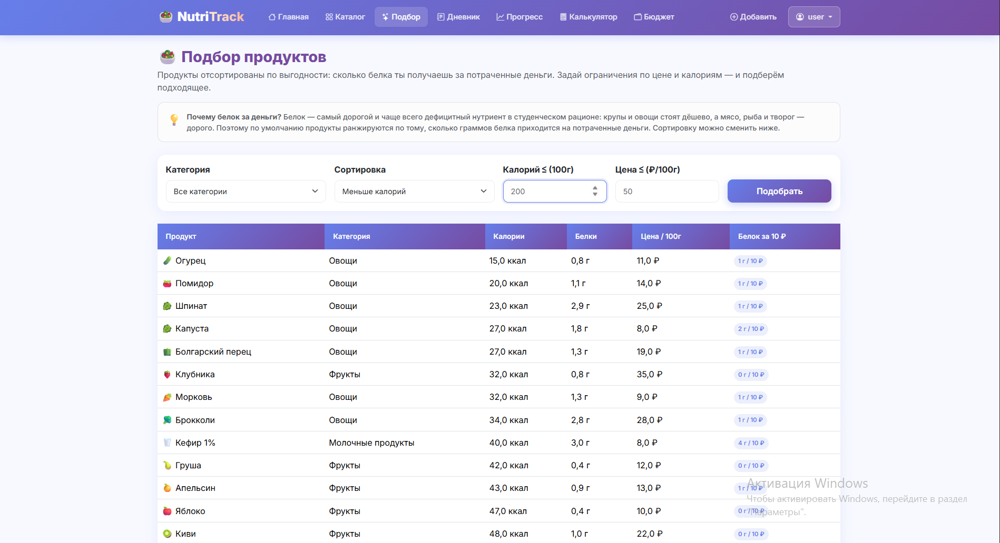

# 🥗 NutriTrack — здоровое питание для студентов

Сервис подбора здорового питания для студентов с ограниченным бюджетом. Помогает выбирать продукты с лучшим соотношением «польза/цена», считает КБЖУ и стоимость рациона и показывает, насколько питание соответствует индивидуальной норме калорий и БЖУ.

**🌐 Рабочий проект:** _ссылка появится после деплоя на PythonAnywhere_

## 📸 Скриншоты




## 🛠 Технологии
| | Стек |
|---|---|
| Backend | Python 3.13, Django 6.0 |
| Визуализация | Plotly |
| Внешний API | Open Food Facts (requests) |
| Frontend | Bootstrap 5.3, Bootstrap Icons, crispy-forms |
| База данных | SQLite |
| Хостинг | PythonAnywhere |

## ✨ Возможности
- 🔍 Каталог с поиском (без учёта регистра, в т.ч. кириллица), фильтрами и сортировкой
- 🥇 Подбор продуктов по выгодности (расчёт в БД через F-объекты)
- 📔 Дневник питания с автоподсчётом КБЖУ и стоимости порции
- 🎯 Индивидуальная норма калорий (формула Миффлина — Сан Жеора) и БЖУ
- 📊 Соответствие съеденного норме + интерактивные графики Plotly
- 💰 Учёт дневного бюджета на еду
- 🌐 Поиск продуктов через внешний API Open Food Facts

## 🚀 Запуск локально
1. Клонировать репозиторий:
```bash
   git clone https://github.com/lizok290406-dot/healthy-nutrition-service.git
   cd healthy-nutrition-service
```
2. Создать и активировать виртуальное окружение:
```bash
   python -m venv venv
   venv\Scripts\activate      # Windows
   source venv/bin/activate   # Linux/Mac
```
3. Установить зависимости:
```bash
   pip install -r requirements.txt
```
4. Создать `.env` из примера и указать SECRET_KEY:
```bash
   copy .env.example .env     # Windows
```
5. Применить миграции:
```bash
   python manage.py migrate
```
6. Наполнить базу продуктами:
```bash
   python seed_products.py
```
7. Создать администратора:
```bash
   python manage.py createsuperuser
```
8. Запустить сервер:
```bash
   python manage.py runserver
```
   Открыть http://127.0.0.1:8000

## 📦 Модели данных
- **Category** — категории продуктов
- **Product** — продукты с КБЖУ и ценой на 100 г
- **UserProfile** — профиль с расчётом нормы калорий, БЖУ и ИМТ
- **DiaryEntry** — записи дневника питания
- **BudgetPlan** — дневной бюджет на еду