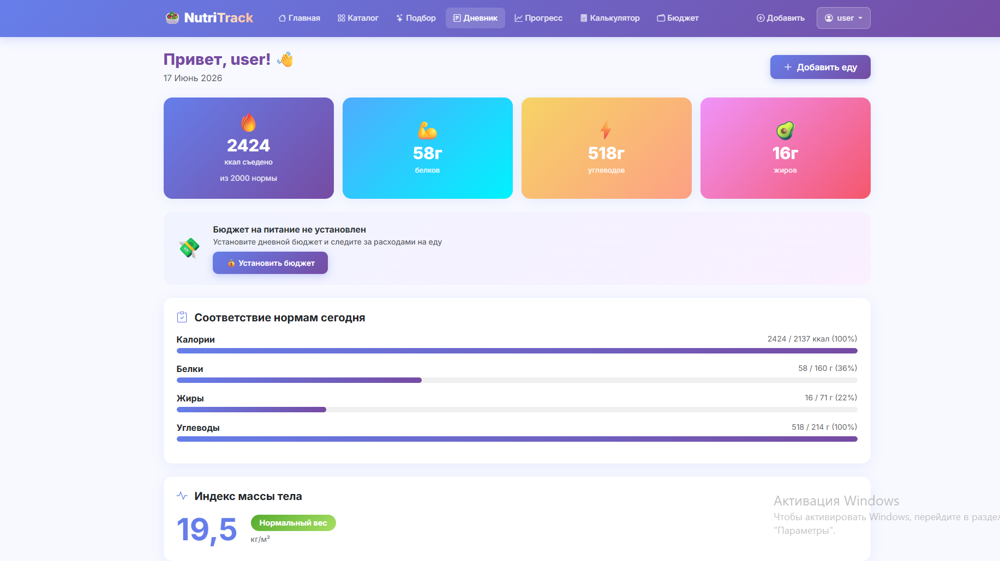

# 🥗 NutriTrack — Умный сервис отслеживания питания

Персональный дневник питания с расчётом индивидуальной нормы калорий по
формуле Миффлина — Сан Жеора, аналитикой на базе Pandas и интерактивными
графиками Plotly. Помогает пользователям осознанно управлять рационом и
достигать своих целей.

**🌐 Рабочий проект:** [https://ваш-логин.pythonanywhere.com](https://ваш-логин.pythonanywhere.com)

## 📸 Скриншоты


*Главная страница с героем и каталогом категорий*


*Дневник питания с графиками Plotly*


*Фильтрация и поиск через API*

## 🛠 Технологии

| | Стек |
|---|---|
| **Backend** | Python 3.10, Django 4.2 |
| **Аналитика** | Pandas 2.1, Plotly 5.18 |
| **API** | Nutritionix API (requests) |
| **Frontend** | Bootstrap 5.3, Bootstrap Icons |
| **Формы** | Django Forms / ModelForms |
| **БД** | SQLite (dev), совместимо с PostgreSQL |
| **Хостинг** | PythonAnywhere |

## 🚀 Запуск локально

### 1. Клонировать репозиторий
```bash
git clone https://github.com/lizok290406/healthy-nutrition-service.git
cd healthy-nutrition-service
```

### 2. Создать виртуальное окружение
```bash
python -m venv venv
# Linux/Mac:
source venv/bin/activate
# Windows:
venv\Scripts\activate
```

### 3. Установить зависимости
```bash
pip install -r requirements.txt
```

### 4. Создать файл .env
```bash
cp .env.example .env
# Откройте .env и заполните SECRET_KEY
```

### 5. Выполнить миграции
```bash
python manage.py migrate
```

### 6. Загрузить тестовые данные
```bash
python manage.py loaddata fixtures/initial_data.json
```

### 7. Создать суперпользователя
```bash
python manage.py createsuperuser
```

### 8. Запустить сервер
```bash
python manage.py runserver
```

Открыть: [http://127.0.0.1:8000](http://127.0.0.1:8000)

## 📊 Модели данных

- **FoodCategory** — категории продуктов
- **FoodItem** — продукты с нутриентами (калории, БЖУ, клетчатка)
- **UserProfile** — профиль с расчётом BMR/TDEE/BMI
- **MealLog** — дневник приёмов пищи
- **WeightLog** — дневник динамики веса

## ✨ Ключевые функции

- 🔢 Расчёт нормы калорий (формула Миффлина — Сан Жеора)
- 📊 Интерактивные графики Plotly (калории за 7/30 дней, динамика веса)
- 🔍 Поиск продуктов через Nutritionix API (AJAX)
- 📈 Аналитика Pandas (средние, мин., макс. за период)
- 🎯 Отслеживание прогресса по цели (похудение/поддержание/набор)